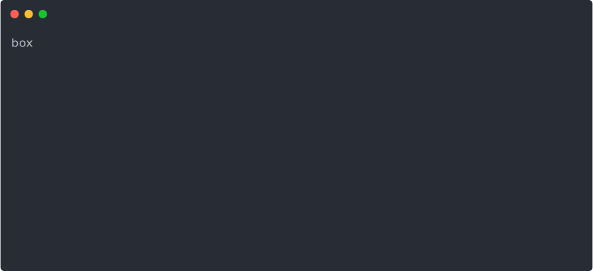

# terminal-ai

Effortless AI in your terminal.

[](https://github.com/dwmkerr/terminal-ai/actions/workflows/main.yml)  [](https://codecov.io/gh/dwmkerr/terminal-ai)

Quickly turn on, turn off, list, show costs and connect to your AWS instances. Great for saving costs by running servers in the cloud and starting them only when needed.



## Quickstart

Install Terminal AI:

```bash
npm install @dwmkerr/terminal-ai
```

Run the tool to configure your environment and start interactively interfacing with AI:

```bash
ai
```

That's it.

Every feature can be used as a command or in an interactive session.

The quickest way to learn how to use the tool is to look at the [#examples](#examples). Each [command](#command) is documented below.

## Examples

WIP

## Commands

WIP

### `boxes config`

Shows the current configuration that has been loaded for `boxes`. Can be helpful for troubleshooting whether things like the region are set properly:

```bash
% boxes config
{
  "boxes": ...
  "aws": {
    "region": "us-west-2"
  }
}
```

**debug config** - show how the configuration has been constructed


## Configuration

A local `boxes.json` file can be used for configuration. The following values are supported:

```
{
  "boxes": {
    /* box configuration */
  },
  "aws": {
    "region": "us-west-2"
  },
  "archiveVolumesOnStop": true,
  "debugEnable": "boxes*"
}
```

Box configuration is evolving rapidly and the documentation will be updated. The AWS configuration is more stable.

## Developer Guide

Clone the repo, install dependencies, build, link, then the `boxes` command will be available:

```bash
git clone git@github.com:dwmkerr/boxes.git
# optionally use the latest node with:
# nvm use --lts
npm install
npm run build
npm link boxes # link the 'boxes' command.

# Now run boxes commands such as:
boxes list

# Clean up when you are done...
npm unlink
```

The CLI uses the current local AWS configuration and will manage any EC2 instances with a tag named `boxes.boxid`. The value of the tag is the identifier used to manage the specific box.

Note that you will need to rebuild the code if you change it, so run `npm run build` before using the `boxes` alias. A quick way to do this is to run:

```bash
npm run relink
```

If you are developing and would like to run the `boxes` command without relinking, just build, link, then run:

```bash
npm run build:watch
```

This will keep the `./build` folder up-to-date and the `boxes` command will use the latest compiled code. This will *sometimes* work but it might miss certain changes, so `relink` is the safer option. `build:watch` works well if you are making small changes to existing files, but not if you are adding new files (it seems).

### Debugging

The [`debug`](https://github.com/debug-js/debug) library is used to make it easy to provide debug level output. Debug logging to the console can be enabled with:

```bash
AI_DEBUG_ENABLE="1" npm start
```

The debug namespaces can be configured like so:

```bash
AI_DEBUG_NAMESPACE='ai*'
```

### Debug Commands


### Error Handling

To show a warning and terminate the application, throw a `TerminatingWarning` error:

```js
import { TerminatingWarning } from "./errors.js";
throw new TerminatingWarning("Your AWS profile is not set");
```

### Terminal Recording / asciinema

To create a terminal recording for the documentation:

- Install [asciinema](https://asciinema.org/) `brew install asciinema`
- Check that you have your profiles setup as documented in `./scripts/record-demo.sh`
- Run the script to start a 'clean' terminal `./scripts/record-demo.sh`
- Download your recording, e.g. to `./docs/620124.cast`
- Install [svg-term-cli](https://github.com/marionebl/svg-term-cli) `npm install -g svg-term-cli`
- Convert to SVG: `svg-term --in ./docs/620124.cast --out docs/democast.svg --window --no-cursor --from=1000`

The demo script is currently:

- `boxes ls`
- `boxes start steambox`
- `boxes costs --yes`
- `boxes ssh torrentbox`
- `boxes stop steambox`
- `boxes ls`

### Concepts

**Actions** - these are commander.js functions that are called by the CLI. They should validate/decode parameters and ask for missing parameters. They will then call a **command**.
**Commands** - these are the underlying APIs that the CLI offers - they are agnostic of the command line interface (and could therefore be exposed in a web server or so on).

## Design Goals

- **Interactive by default** - with no input, `ai` is friendly and interactive. Everything that can be done interactively can be done non-interactively. Interactive operations hint at how to run non-interactively.

## Technical Documentation

### Context Prompts

Additional env vars set:

| Environment Variable | Description            |
|----------------------|------------------------|
| `OS_PLATFORM`           | `nodejs os.platform()` |

## TODO

Quick and dirty task-list.

**Chat - book ready**

- [x] enable non interactive - no terminal colors
- [ ] build
- [x] close input ctrl+c handle
- [x] hydrate config on startup
- [ ] document chat
- [ ] nth: reply/copy/quit options
- [ ] nth: chat command needs error handling
- [ ] nth: terminal size
- [ ] nth: kill boxes commands

- test: when downloading, no output shown when piping to a file (except for the chat output)


---

- [ ] nth(chat): line up input/output prompts on the colon

- [ ] nth: 'vanilla' flag (no prompts)
- [ ] nth: allow context to use env vars eg BASH_VERSION to infer shell
- [ ] nth: terminal size env vars

- [x] base ok boxes
- [ ] really user friendly way to get API key set
- [ ] we can check first time run via presence of config file
- [ ] Input: <prompt>: input
- [ ] Call from vi example
- [ ] Put in effective shell chapter
- [ ] Check competitors
- [ ] Spinners
- [ ] Interactive mode shows prompt in green press up down to cycle modes
- [ ] Chat mode default
- [ ] Output: file -suggestion name and format eg ics 
- [ ] Clipboard
- [ ] Structure: context prompt / input prompt / text / output mode
- [ ] GitHub mode
- [ ] Vanilla mode
- [ ] Online instructions for api key
- [ ] Videos on LinkedIn
- [ ] When code is shown offer copy command
- [ ] Execution context tty 
- [ ] Location specific prompts, eg create a .ai folder, include prompts in it, tai shows them
- [ ] docs: readline/prompt input keyboard shortcuts (cancel, copy, etc)
- [ ] nth: unhandled error prettier printing
