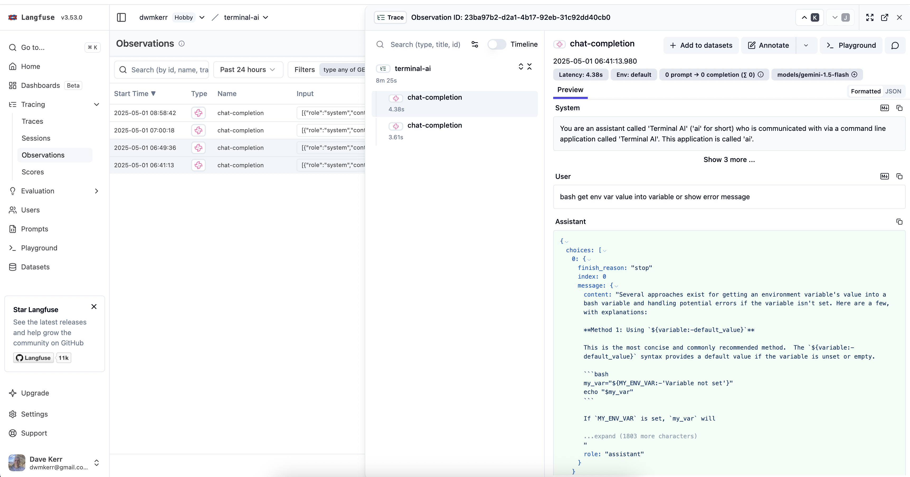

# Integrations

Terminal AI can integrate with various external services to enhance its capabilities. This document explains the available integrations and how to configure them.

<!-- vim-markdown-toc GFM -->

- [Langfuse](#langfuse)
    - [Setup](#setup)
    - [Configuration Options](#configuration-options)

<!-- vim-markdown-toc -->

## Langfuse

[Langfuse](https://langfuse.com) is an open-source observability platform for LLM applications. Integrating Terminal AI with Langfuse allows you to:

- Track conversations and model interactions
- Monitor latency, token usage and costs
- Debug issues in production
- Analyze model performance over time



### Setup

To configure Langfuse integration with Terminal AI:

1. Create a Langfuse account at [langfuse.com](https://langfuse.com) or self-host it
2. Create a new Lanfuse project
3. Obtain your Langfuse secret key and public key
4. Add the Langfuse configuration to your `~/.ai/config.yaml` file:

```yaml
integrations:
  langfuse:
    secretKey: "your-langfuse-secret-key"
    publicKey: "your-langfuse-public-key"
    baseUrl: "https://cloud.langfuse.com"
    traceName: "terminal-ai"
```

You can validate your Langfuse configuration by running:

```bash
ai check
```

### Configuration Options

| Configuration Option | Default Value | Description |
|----------------------|---------------|-------------|
| `secretKey` | (empty) | Your Langfuse secret key (required) |
| `publicKey` | (empty) | Your Langfuse public key (required) |
| `baseUrl` | `https://cloud.langfuse.com` | The Langfuse API endpoint |
| `traceName` | `terminal-ai` | The name to use for traces in Langfuse |

If you're self-hosting Langfuse, change the `baseUrl` to your instance URL.
